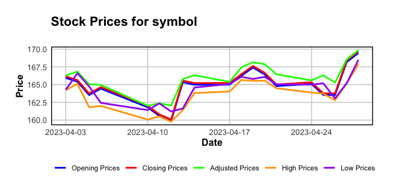

# Stock_Analyzer_R_PyScript

This repository contains scripts for analyzing stock prices using both R and Python. The scripts allow users to fetch stock data, visualize it using charts, and customize the analysis based on their requirements. The repository includes the following files:

- `stock_analyzer.R`: R script for analyzing stock prices. It retrieves stock data from Yahoo Finance, filters it based on user-defined date range, and plots the prices using ggplot2.
- `stock_analyzer.py`: Python script that modifies the `stock_analyzer.R` script and executes it using RStudio. It provides a user interface to input stock symbols, date ranges, and scale options for the plot.
- `stock_analyzer.exe`: Executable file generated from the `stock_analyzer.py` script for easy execution on Windows operating system.

## Usage

1. Clone the repository to your local machine using the following command:

   ```
   git clone https://github.com/your-username/Stock_Analyzer_R_PyScript.git
   ```

2. Make sure you have the required dependencies and libraries installed for both R and Python. Refer to the individual script files for the list of required libraries.

3. Run the `stock_analyzer.R` script directly in an R environment to analyze stock prices. Modify the `symbol`, `start_date`, and `end_date` variables according to your desired stock and date range.

4. To use the Python script (`stock_analyzer.py`) for executing the R script with a user interface, follow these steps:

   - Ensure that R and RStudio are installed on your system.
   - Place your original R script file ("stock_analyzer.R") in the same folder as the Python script.
   - Execute the `stock_analyzer.py` script using Python. It will prompt you to input the stock symbol, date range, and scale options for the plot.
   - The script will modify the R script file with the provided inputs, execute it using RStudio, and open the resulting plot.

5. If you prefer using the executable file (`stock_analyzer.exe`), simply double-click on it to launch the program. The executable file eliminates the need for installing dependencies and running the script from the command line.

## Sample Output

Here is an example of a line graph generated by executing the `stock_analyzer.R` script:



## Contributing

Contributions to this repository are welcome. If you find any issues or have suggestions for improvement, please open an issue or submit a pull request. 

## License

The scripts in this repository are licensed under the [MIT License](LICENSE).